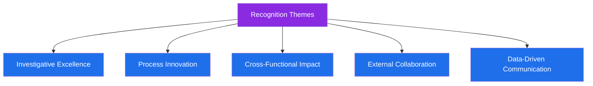

# 🏆 Awards & Recognition

## 📋 Table of Contents
- [Overview](#overview)
- [Recognition Highlights](#recognition-highlights)
- [Recognition Themes](#recognition-themes)

---

## Overview

Throughout my career, my contributions to fraud prevention, process improvement, and cross-functional risk initiatives have been recognized by peers and leadership. This page summarizes the **categories** of recognition I've received, presented generically to protect confidential employer details.

---

## Recognition Highlights

| 🏅 Recognition Type | Area | What It Recognized |
|---|---|---|
| Outstanding Investigator Recognition | Fraud Operations | Consistently high-quality, high-volume case resolution |
| Process Innovation Award | Process Improvement | Automation initiative that reduced manual review time significantly |
| Cross-Functional Collaboration Recognition | Risk Strategy | Leading a multi-team fraud prevention initiative to successful rollout |
| Compliance Partnership Recognition | AML/KYC | Strong contribution to suspicious activity reporting quality |
| Law Enforcement Liaison Commendation | External Collaboration | Effective, timely cooperation with law enforcement on case referrals |
| Data Storytelling Recognition | Tableau / Reporting | Dashboard work that improved leadership decision-making speed |

---

## Recognition Themes

> 📝 **Note:** Specific award names, dates, and issuing organizations have been generalized in this public portfolio to respect confidentiality agreements. Full details are available upon request during the interview process.

---

⬅️ [Back: Core-Skills.md](./Core-Skills.md) | ➡️ [Next: Certifications.md](./Certifications.md)

