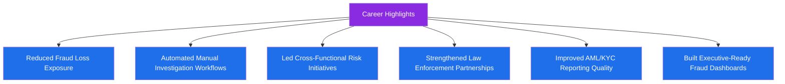

# ✨ Career Highlights

## 📋 Table of Contents
- [Overview](#overview)
- [Highlight Reel](#highlight-reel)
- [Impact Areas](#impact-areas)
- [Representative Achievements](#representative-achievements)

---

## Overview

Below is a curated, generalized set of career highlights that reflect the type and scale of impact I've driven across fraud operations, financial crime, and risk strategy roles. Specific figures and employer names have been generalized to protect confidentiality.

---

## Highlight Reel

---

## Impact Areas

| Area | Highlight |
|---|---|
| 🛡️ **Fraud Loss Reduction** | Contributed to meaningful reductions in fraud loss exposure through improved detection rules and investigation quality |
| ⚙️ **Automation** | Designed Google Apps Script tools that automated repetitive investigation and reporting tasks, freeing up analyst time for higher-value work |
| 🤝 **Cross-Functional Leadership** | Led initiatives bringing together Fraud, Compliance, Product, and Engineering to close systemic risk gaps |
| 👮 **Law Enforcement Collaboration** | Built and formalized a structured process for evidence packaging and law enforcement liaison, improving case referral quality and turnaround |
| 📋 **AML/KYC Reporting** | Improved the consistency and quality of suspicious activity reporting through better documentation standards |
| 📊 **Executive Reporting** | Built Tableau dashboards that gave leadership real-time visibility into fraud trends, enabling faster strategic decisions |

---

## Representative Achievements

- ✅ Designed and implemented a **merchant risk scoring framework** that improved early identification of high-risk merchants
- ✅ Led a **transaction monitoring rule optimization project** that improved alert precision and reduced analyst fatigue from false positives
- ✅ Built **AI-assisted investigation workflows** that accelerated case triage without compromising investigative quality
- ✅ Partnered with Legal and Compliance to strengthen the **evidence packaging process** for law enforcement referrals
- ✅ Mentored junior fraud analysts, helping them grow into confident, independent investigators
- ✅ Presented fraud trend analysis to senior leadership, directly informing risk strategy decisions

---

⬅️ [Back: Professional-Values.md](./Professional-Values.md) | ⬆️ [Back to README](./README.md)

