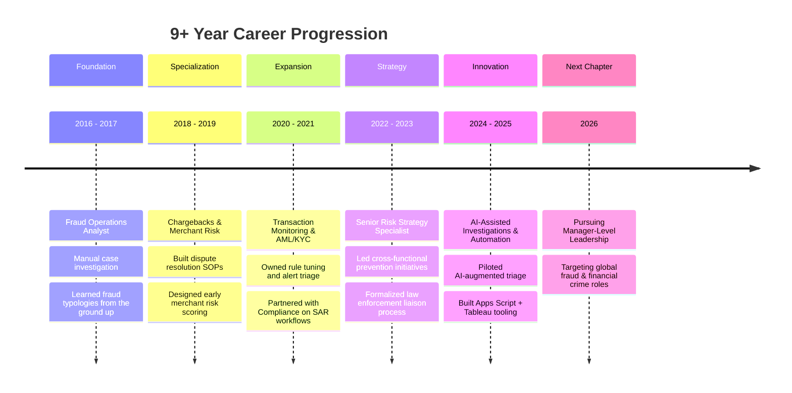

# 🛤️ Career Journey

## 📋 Table of Contents
- [Overview](#overview)
- [Career Timeline](#career-timeline)
- [Stage-by-Stage Narrative](#stage-by-stage-narrative)
- [Career Trajectory Diagram](#career-trajectory-diagram)
- [What's Next](#whats-next)

---

## Overview

My career has progressed deliberately — from **frontline fraud investigation** to **strategic risk leadership** — with each stage adding a new layer of depth: first the *craft* of investigation, then the *systems* of risk management, and now the *strategy* of leading fraud and financial crime programs.

---

## Career Timeline

---

## Stage-by-Stage Narrative

### 🔹 Stage 1: Building the Foundation (Fraud Operations)
I began my career on the front line of fraud investigations — reviewing transactions, identifying fraud typologies, and learning to separate genuine anomalies from noise. This stage taught me the discipline of **evidence-based decision-making** under time pressure.

### 🔹 Stage 2: Specializing in Merchant Risk & Chargebacks
As my caseload expertise grew, I moved into **merchant risk and chargeback management**, where I helped design structured dispute-resolution workflows and early merchant risk-scoring approaches — reducing loss exposure while improving resolution turnaround.

### 🔹 Stage 3: Owning Transaction Monitoring & AML/KYC
I took ownership of **transaction monitoring rule design and tuning**, and expanded into **AML/KYC**, partnering closely with Compliance on suspicious activity identification and reporting — bridging the gap between fraud and financial crime disciplines.

### 🔹 Stage 4: Leading Risk Strategy
I moved into a **senior risk strategy** capacity, leading cross-functional initiatives that connected fraud operations, product, and engineering. During this stage I also formalized processes for **law enforcement collaboration**, ensuring evidence packaging and liaison communication met a consistently high standard.

### 🔹 Stage 5: Driving Innovation Through AI & Automation
Most recently, I've focused on **AI-assisted investigations** and **process automation** — piloting AI-augmented case triage and building Google Apps Script and Tableau tools that materially increased team efficiency and investigation quality.

---

## Career Trajectory Diagram

```mermaid
graph LR
    A[Fraud Operations Analyst] --> B[Chargebacks & Merchant Risk Specialist]
    B --> C[Transaction Monitoring & AML/KYC Specialist]
    C --> D[Senior Risk Strategy Specialist]
    D --> E[AI-Assisted Investigations Lead]
    E --> F[Fraud & Financial Crime Manager - Target Role]

    style A fill:#30363d,color:#fff
    style B fill:#1f6feb,color:#fff
    style C fill:#1f6feb,color:#fff
    style D fill:#8A2BE2,color:#fff
    style E fill:#8A2BE2,color:#fff
    style F fill:#da3633,color:#fff
```

---

## What's Next

I'm now pursuing **Manager-level roles in Fraud Risk and Financial Crime**, ideally with organizations operating across multiple markets. I'm particularly drawn to teams that value **investigative rigor, data-driven strategy, and cross-border collaboration** — and I'm excited to bring 9+ years of frontline-to-strategic experience to that next chapter.

---

⬅️ [Back: Professional-Profile.md](./Professional-Profile.md) | ➡️ [Next: Core-Skills.md](./Core-Skills.md)

