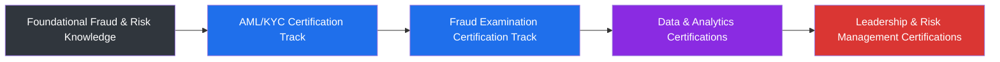

# 📜 Certifications & Professional Development

## 📋 Table of Contents
- [Overview](#overview)
- [Certification Roadmap](#certification-roadmap)
- [Areas of Focus](#areas-of-focus)

---

## Overview

Certifications are a core part of how I formalize and validate the practical expertise I've built over 9+ years in fraud and financial crime. This page tracks certifications held, in progress, and planned as part of my journey toward Manager-level roles.

---

## Certification Roadmap

| Category | Focus Area | Status |
|---|---|---|
| Anti-Money Laundering | AML/KYC compliance frameworks and regulatory standards | 🎯 Planned / In Progress |
| Fraud Examination | Fraud detection, investigation, and prevention methodology | 🎯 Planned / In Progress |
| Data Analytics | SQL and data visualization for risk analytics | ✅ Practical Proficiency |
| Risk Management | Enterprise risk frameworks and strategic risk governance | 🎯 Planned |
| Leadership Development | People and program management for risk teams | 🎯 Planned |

---

## Areas of Focus

- **Anti-Money Laundering & Know Your Customer (AML/KYC)** — deepening formal expertise in regulatory compliance frameworks
- **Certified Fraud Examination** — pursuing recognized credentials in fraud investigation methodology
- **Data & Analytics** — continuing to build advanced SQL and Tableau capabilities for risk reporting
- **Risk Management & Governance** — preparing for broader enterprise risk management responsibilities
- **People Leadership** — developing management and team-leadership capabilities in preparation for manager-level roles

> 📝 **Note:** This page is intentionally framed as a living roadmap. Specific certification names and completion dates are shared directly with recruiters and hiring teams upon request.

---

⬅️ [Back: Awards.md](./Awards.md) | ➡️ [Next: Professional-Philosophy.md](./Professional-Philosophy.md)

