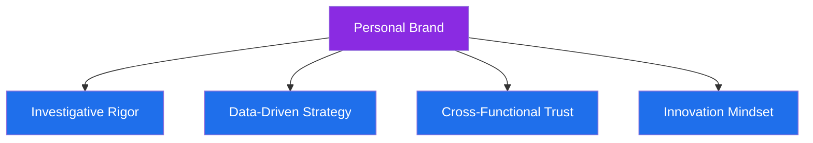

# 🎯 Personal Brand

## 📋 Table of Contents
- [Brand Statement](#brand-statement)
- [Brand Pillars](#brand-pillars)
- [How I Show Up](#how-i-show-up)
- [Visual Identity](#visual-identity)

---

## Brand Statement

> **"I turn transaction noise into fraud signal — building the systems, strategies, and teams that keep fintech platforms safe without slowing them down."**

My personal brand is built around being the professional who can move fluidly between **hands-on investigation** and **strategic risk leadership** — someone who is as comfortable writing a SQL query to trace a fraud ring as they are briefing leadership on a new risk strategy.

---

## Brand Pillars

| Pillar | What It Means |
|---|---|
| 🔍 **Investigative Rigor** | Every conclusion is backed by evidence, not assumption |
| 📊 **Data-Driven Strategy** | Decisions are grounded in SQL, Tableau, and measurable outcomes |
| 🤝 **Cross-Functional Trust** | Reliable partner to Compliance, Product, Engineering, and Law Enforcement |
| 🚀 **Innovation Mindset** | Early adopter of AI-assisted investigation and automation tooling |

---

## How I Show Up

- I show up as a **calm, methodical investigator** in high-pressure fraud cases
- I show up as a **translator** between technical fraud data and business/executive audiences
- I show up as a **builder**, always looking for the next process to automate or improve
- I show up as a **collaborator**, bridging fraud, compliance, and law enforcement stakeholders

---

## Visual Identity

**Primary Themes:** Trust, precision, vigilance, clarity
**Suggested Color Palette:** Deep blue (trust/stability), purple (strategy/innovation), red accent (alert/risk)
**Tone of Voice:** Confident, precise, calm, evidence-based

---

⬅️ [Back: LinkedIn.md](./LinkedIn.md) | ➡️ [Next: Learning-Roadmap.md](./Learning-Roadmap.md)

