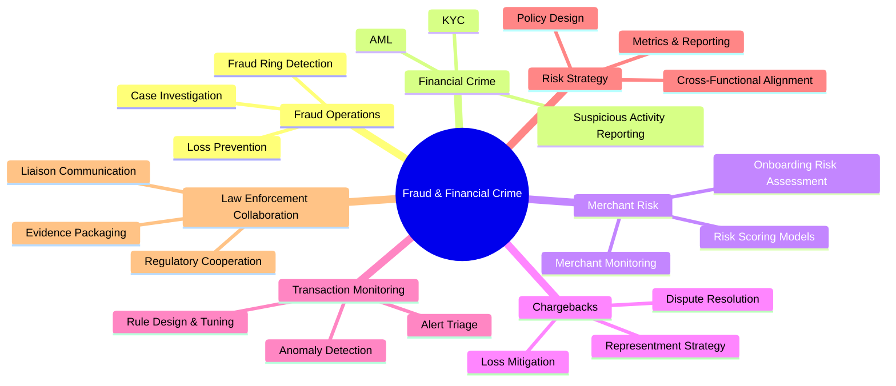

# 🧭 Professional Profile

## 📋 Table of Contents
- [Executive Summary](#executive-summary)
- [Professional Identity](#professional-identity)
- [Domain Expertise](#domain-expertise)
- [Technical Fluency](#technical-fluency)
- [Working Style](#working-style)
- [Career Objective](#career-objective)

---

## Executive Summary

I am a **Senior Fraud & Financial Crime Professional** with over **9 years of experience** building and running fraud prevention, financial crime, and risk operations programs inside high-growth fintech and payments environments. My career has been shaped by a simple mandate: **protect the integrity of the platform without compromising the customer or merchant experience.**

I operate at the intersection of **investigations, data, and strategy** — equally comfortable running a deep-dive fraud investigation, designing a transaction monitoring rule, briefing law enforcement, or building a Tableau dashboard that turns raw case data into an executive-ready narrative.

---

## Professional Identity

| Attribute | Description |
|---|---|
| 🎯 **Primary Domain** | Fraud Operations & Financial Crime |
| 🏢 **Industry** | Fintech / Digital Payments |
| 🧠 **Specialization** | Merchant Risk, Chargebacks, AML/KYC, Transaction Monitoring |
| 🛠️ **Technical Toolkit** | SQL, Tableau, Google Apps Script, AI-Assisted Investigation Tools |
| 🌍 **Career Direction** | Manager-level fraud & financial crime leadership, internationally |
| 🤝 **Cross-Functional Reach** | Compliance, Legal, Product, Engineering, Law Enforcement |

---

## Domain Expertise

---

## Technical Fluency

- **SQL** — writing and optimizing complex queries for fraud pattern discovery, case analytics, and reporting automation
- **Tableau** — designing executive dashboards that translate fraud and risk data into decision-ready visuals
- **Google Apps Script** — automating repetitive investigation and reporting workflows to increase team throughput
- **AI-Assisted Investigations** — leveraging AI tooling to accelerate case triage, pattern recognition, and documentation quality

---

## Working Style

I bring a **structured, evidence-first approach** to every investigation and a **strategic, metrics-driven approach** to every process I design. I believe the best fraud programs are built on three pillars:

1. **Precision** — every decision should be traceable to evidence and data
2. **Scalability** — every process should work as well at 10x volume as it does today
3. **Collaboration** — fraud is a team sport across compliance, product, engineering, and law enforcement

---

## Career Objective

I am currently pursuing **Manager-level roles in Fraud Risk and Financial Crime Compliance** with global fintech and payments organizations, with particular interest in opportunities across **Europe, the United Kingdom, and Asia-Pacific**. My goal is to bring proven investigative rigor and process-improvement discipline to a team operating at even greater scale and complexity.

---

⬅️ [Back to README](./README.md) | ➡️ [Next: Career-Journey.md](./Career-Journey.md)

