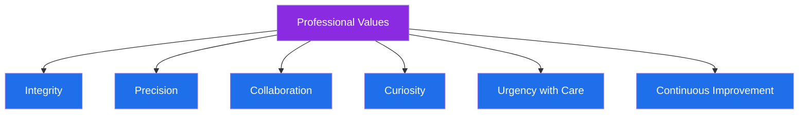

# ⚖️ Professional Values

## 📋 Table of Contents
- [Core Values](#core-values)
- [Values in Action](#values-in-action)
- [Values Diagram](#values-diagram)

---

## Core Values

| Value | What It Means to Me |
|---|---|
| 🔒 **Integrity** | Every investigation and decision must hold up to scrutiny — from a peer, a regulator, or a court |
| 🎯 **Precision** | Fraud work has no room for "close enough" — accuracy protects both the platform and the customer |
| 🤝 **Collaboration** | Fraud prevention is a team sport spanning Compliance, Product, Engineering, and Law Enforcement |
| 🔍 **Curiosity** | The best investigators keep asking "why" long after the obvious answer appears |
| ⚡ **Urgency with Care** | Fraud moves fast, but decisions that affect real customers and merchants deserve careful judgment |
| 🌱 **Continuous Improvement** | Every process, rule, and workflow can be made faster, clearer, or more effective |

---

## Values in Action

- I **document everything** — not because I distrust my own judgment, but because good documentation protects the integrity of every case
- I **escalate early** when something looks systemic rather than isolated
- I **push back respectfully** when a proposed shortcut compromises investigative quality
- I **mentor and share knowledge** freely, because a stronger team makes for a stronger fraud program
- I **stay calm under pressure**, especially during high-stakes fraud events or law enforcement engagements

---

## Values Diagram

---

⬅️ [Back: Learning-Roadmap.md](./Learning-Roadmap.md) | ➡️ [Next: Career-Highlights.md](./Career-Highlights.md)

