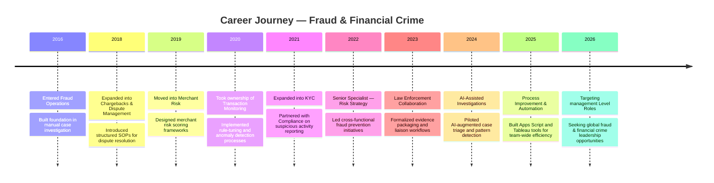
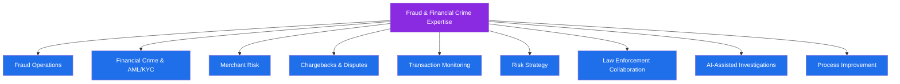

# 👋 About Me — Fraud Intelligence Lab

### Senior Fraud & Financial Crime Professional | 9+ Years in Fintech

**Turning transaction noise into fraud signal — one investigation at a time.**

---

## 📖 Table of Contents

| # | Document | Description |
|---|----------|--------------|
| 1 | [Professional-Profile.md](./Professional-Profile.md) | 🧭 Executive summary of who I am professionally |
| 2 | [Career-Journey.md](./Career-Journey.md) | 🛤️ My career timeline and evolution across fraud & financial crime |
| 3 | [Core-Skills.md](./Core-Skills.md) | 🛠️ Technical and domain skill matrix |
| 4 | [Certifications.md](./Certifications.md) | 📜 Professional certifications and credentials |
| 5 | [Professional-Philosophy.md](./Professional-Philosophy.md) | 🧠 How I think about fraud, risk, and investigations |
| 6 | [Contact.md](./Contact.md) | 📬 How to reach me |
| 7 | [Personal-Brand.md](./Personal-Brand.md) | 🎯 My personal brand statement |
| 8 | [Learning-Roadmap.md](./Learning-Roadmap.md) | 📚 Continuous learning plan |
| 9 | [Professional-Values.md](./Professional-Values.md) | ⚖️ The values that guide my work |
| 10 | [Career-Highlights.md](./Career-Highlights.md) | ✨ Notable career highlights and impact stories |

---

## 🧭 Who I Am

I am a **Senior Fraud & Financial Crime Professional** with **9+ years** of experience protecting fintech platforms, payment ecosystems, and merchant networks from fraud, financial crime, and abuse. My work spans **fraud operations, transaction monitoring, AML/KYC, merchant risk, chargebacks, risk strategy, and law enforcement collaboration**, supported by strong technical fluency in **SQL, Tableau, Google Apps Script, and AI-assisted investigation techniques**.

This repository, **Fraud Intelligence Lab**, is a curated portfolio of frameworks, playbooks, dashboards, and case-study style projects that demonstrate how I approach fraud detection, investigation, and prevention at scale — without exposing any confidential, proprietary, or employer-specific data.

---

## 🗺️ Career Snapshot (Mermaid Timeline)

---

## 🔍 Focus Areas

---

## 🎯 What This Folder Is For

This `00-About-Me` folder is the front door to the **Fraud Intelligence Lab** repository. It's designed for:

- 👥 **Recruiters & Hiring Managers** who want a fast, credible overview of my background
- 🧑‍💼 **Fraud & Risk Leaders** evaluating my technical depth and strategic thinking
- 🤝 **Peers & Collaborators** who want to understand my working philosophy
- 🌍 **My own record** of growth, achievements, and direction as I pursue international manager-level opportunities

> 💡 **Note:** All content in this repository has been generalized and anonymized. No confidential employer data, proprietary systems, or internal metrics are disclosed.

---

**➡️ Start with [Professional-Profile.md](./Professional-Profile.md) to learn more about my background.**

